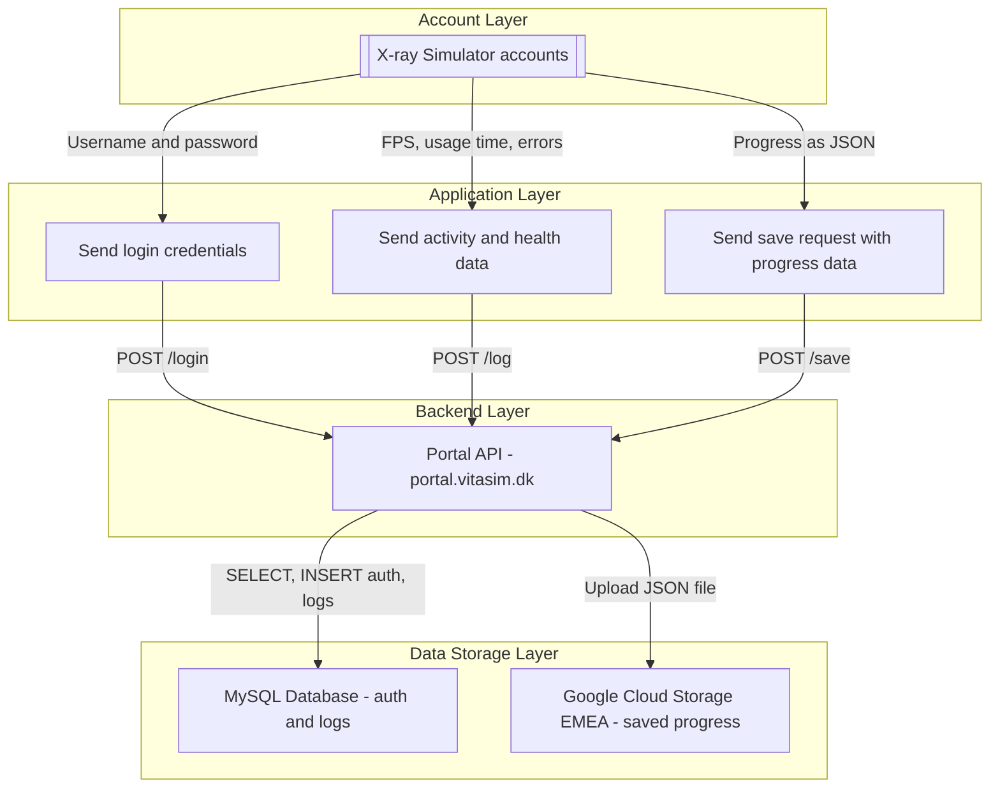

## **Introduction**

The X-ray Simulator is an advanced X-ray simulation software designed to support educational institutions in providing high-quality training for radiologic technology students. This guide addresses key security, compliance, and technical considerations for IT and security personnel evaluating the solution.

## **Business Purpose & Functionality**

### **What is the X-ray Simulator?**

The X-ray Simulator is a virtual training platform that allows educators to simulate real-world X-ray imaging scenarios. It enhances student learning through interactive exercises, and risk-free guided training.

#### **Key Features:**

* Realistic X-ray simulation for student training
* Interactive image acquisition and positioning
* Scalable platform for individual and classroom use
* Secure locally installed software with online account authentication

## **Common Questions:**

### Who would our direct contact be for support/assistance?
Support is provided through the options listed [here](/Support/support), and reference guides and documentation can be found on [The support page](/welcome). Support is available during the times listed on the website.

### Is the software cloud-based?
No, the X-ray Simulator is a self-contained desktop-based software that requires installation on a PC. However, it does use the internet for account authentication during login.

### Does the software integrate with any other systems?
No, the X-ray Simulator does not integrate with external systems. It is a standalone application that must be installed on a PC. 

### What types of data are collected and stored in the X-ray Simulator?
The software does **not** store any personal data (PII). Instead, institutions use [X-ray Simulator accounts](/Guides/Introduction/accounts-and-login) provided by VitaSim. These may be individual student accounts or shared station accounts, depending on the program's preferred setup. The data collected includes:

* **Logging of activity**, such as login time and application performance metrics (e.g., FPS).
* **Simulation progress**, if progress is saved for future sessions.

### What is a shared station account, and why would a program use one?
A shared station account is a generic, non-personalized [X-ray Simulator account](/Guides/Introduction/accounts-and-login#choosing-an-account-setup) that a program can use for a shared simulator station. This is common for VR stations where the headset and PC are shared equipment. Shared accounts help institutions avoid storing personally identifiable student data in the simulator and can be reset or reassigned as needed.

### Does the X-ray Simulator require an internet connection to function?
The software only requires an internet connection for account authentication upon login.
Logging happens frequently during sessions, but loss of connection after login will not disturb normal simulator operation.

### What are the hardware requirements for using the X-ray Simulator?
The X-ray Simulator requires a PC that adhere to the requirements below for optimal performance. 
The VR version also requires a compatible tethered VR headset. 
Institutions should ensure that their hardware meets the system requirements before installation.

* For **VR hardware requirements**, visit: [Minimum Requirements for VR the X-ray Simulator](/Tech/minimum-requirements-for-running-the-vr-xray-simulator)
* For **Desktop hardware requirements**, visit: [Minimum Requirements for Desktop the X-ray Simulator](/Tech/minimum-requirements-for-running-the-desktop-xray-simulator)

### How are accounts managed within the X-ray Simulator?
Institutions receive [X-ray Simulator accounts](/Guides/Introduction/accounts-and-login#x-ray-simulator-accounts) from VitaSim after purchase. A program can use individual student accounts, shared station accounts, or a mix of both.
These accounts do not need to store personal student identity data and can be reset or replaced through the program's CSM or VitaSim support.

### Does the X-ray Simulator support role-based access?
No, the X-ray Simulator operates on a simple account authentication model.
An account either has access or does not; there are no distinct roles or permission levels within the system.

### How is the X-ray Simulator installed and managed on institutional computers?
The software requires **administrator privileges** for installation on institutional PCs. 
The software supports MDM deployment. 
Once installed, students can access it using the X-ray Simulator accounts provided for the program or station. See [Accounts and Login](/Guides/Introduction/accounts-and-login) for the difference between simulator accounts, PC logins, admin accounts, and Meta accounts.
Read more on the [setup page](/Tech/Setup-and-installation-guides/VR-X-ray-Simulator-Setup)

### How does the X-ray Simulator handle access control?
Access control is managed at the institutional level by assigning X-ray Simulator account credentials.
The X-ray Simulator does not have internal role-based permissions.

## **Data Handling & Security**

### **Does the X-ray Simulator store or process sensitive data (ePHI, PII, financial information)?**

No. The X-ray Simulator does not collect, store, or process electronic protected health information (ePHI), personally identifiable information (PII), or financial data. The system operates with X-ray Simulator accounts and simulated training data.

#### **How does the X-ray Simulator ensure data security?**

* **Encryption**: All data transmissions related to authentication are encrypted using industry-standard protocols.
* **Access Management**: Institutions control simulator access through assigned account credentials.
* **Data Governance**: No PII data is processed or stored within the application.
* **Audit Logging**: The system maintains detailed logs to track account activity for compliance and security monitoring.

## **Hosting & Compliance**

### **Is the X-ray Simulator hosted externally or on-premises?**

The X-ray Simulator is a locally installed desktop application. It does require an internet connection to authenticate the X-ray Simulator account upon login, but all other operations are performed offline.

### **What security measures are in place for the solution?**

* The X-ray Simulator does not store personal data, ensuring compliance with institutional privacy policies.
* All authentication requests are securely encrypted to prevent unauthorized access.
* The system logs account activity and performance data for troubleshooting and optimization.

### Can you provide a data flow diagram of the infrastructure. 
Yes. Here is the simplified data flow diagram. 

## **Institutional Integration & Deployment**

### **Which institutions and departments use the X-ray Simulator?**

The X-ray Simulator is used by:

* Radiologic technology training programs

### **How does the X-ray Simulator integrate with an institution's existing infrastructure?**

* **Account Authentication**: The X-ray Simulator requires login authentication but does not integrate with external identity management systems.
* **Standalone Operation**: The software does not require integration with Learning Management Systems (LMS) or hospital IT networks.
* **IT Support**: Dedicated support is available for onboarding and technical troubleshooting.

### **Account Management**

The X-ray Simulator uses a system of predefined accounts provided by VitaSim. A program can use individual student accounts, shared station accounts, or a mix of both. The [Accounts and Login](/Guides/Introduction/accounts-and-login) page explains how account count differs from license count.

* No personal student identity data is collected or stored.
* Accounts can be easily reset upon request.
* Simplified account management with no need for role-based access.

For X-ray Simulator account or license questions, contact [sales@vitasim.dk](mailto:sales@vitasim.dk). For PC, Meta, or admin account support, contact [support@vitasim.dk](mailto:support@vitasim.dk).
